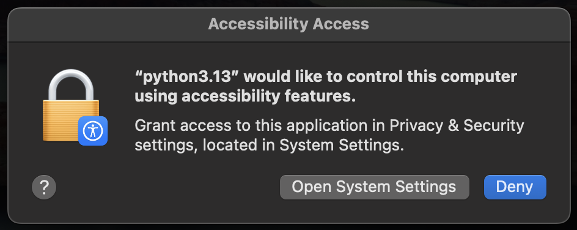
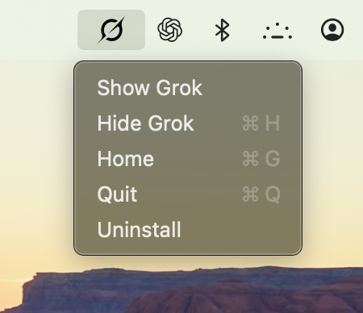

<p align="center">
  <h1 align="center"><code>macos-grok-overlay</code></h1>
</p>

<p align="center">
A simple macOS overlay application for pinning <code>grok.com</code> to a dedicated window and key command <code>option+space</code>.
</p>


## Installation:

  Install the latest stable release with:

```bash
python3 -m pip install macos-grok-overlay
```

  Once you've installed the package, you can enable it to be automatically launched at startup with:

```bash
macos-grok-overlay --install-startup
```

  You will get a request like this to enable Accessibility the first time this launches.



  The Accessibility access is required for the background task to listen for the `Option+Space` keyboard command. But please don't just take my word for it, look at the [listener code yourself](macos_grok_overlay/main.py#L279-L300) and see. ;)

  Within a few seconds of approving Accessibility access, you should see a little icon like this appear along the top of your screen.



  And you're done! Now this should launch automatically and constantly run in the background. If you ever decide you do not want it, see the uninstall instructions below.


## Usage

  Once the application is launched, it should immediately open a window dedicated to `grok.com`. You'll need to log in there, but you should only need to do that once. After installing, pressing `Option + Space` while the window is open will hide it, and pressing it again at any point will reveal it and pin it as the top-most window overlay on top of other applications. This enables quick and easy access to Grok on macOS.

<video controls loop autoplay>
  <source src="https://github.com/tchlux/macos-grok-overlay/raw/main/images/macos-grok-overlay.mp4" type="video/mp4">
</video>

  There is a dropdown menu with basic options that shows when you click the menubar icon. Personally I find that using `Option + Space` to summon and dismiss the dialogue as needed is the most convenient.

<video controls loop autoplay>
  <source src="https://github.com/tchlux/macos-grok-overlay/raw/main/images/macos-grok-overlay-menu.mp4" type="video/mp4">
</video>

  If you decide you want to uninstall the application, you can do that by clicking the option in the menubar dropdown, or from the command line with:

```bash
macos-grok-overlay --uninstall-startup
```


## How it works

  This is a very thin `pyobjc` application written to contain a web view of the current production Grok website. Most of the logic contained in this small application is for stylistic purposes, making the overlay shaped correctly, resizeable, draggable, and able to be summoned anywhere easily with a single keyboard command. There's also a few steps needed to listen specifically for the `Option + Space` keyboard command, which requires Accessibility access to macOS.


## Final thoughts

  This was a small fun weekend project, and is not a product of the xAI team nor is it formally affiliated with them. Please file issues and I'll be happy to adjust, but I also highly recommend you look at the source code yourself if you want to change something. It's a very small and simple project entirely in [main.py](/macos_grok_overlay/main.py), Grok (or similar) could easily help you modify it for your own purposes.
